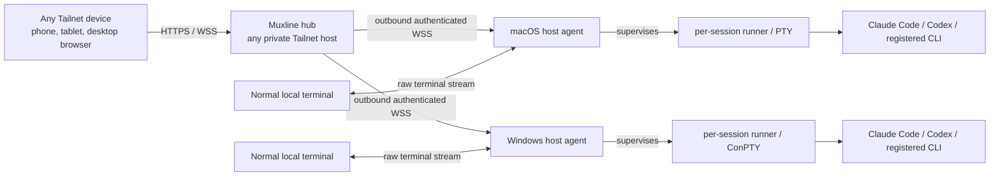

# Muxline

Muxline is a private, self-hosted session index and live-terminal bridge for interactive CLI work. Install a small agent on each macOS or Windows computer you use, register the commands you want to intercept, and open one Tailnet-only web UI from any of your devices.

It is built around the distinction that terminal tools usually blur:

- **Live terminal:** a real PTY still owned by its original host agent. It can be viewed and, after an explicit takeover, controlled from the web UI.
- **Saved logical record:** the durable identity of that launch—host, workspace, harness/profile, native-session pointer when known, lifecycle, and last-known screen. It remains visible after the terminal or host goes away, but is not presented as an interactive terminal.

Muxline is not VNC, SSH-in-a-browser, or a tmux command layer. The original computer still runs Claude Code, Codex, or another registered CLI locally. Muxline relays terminal bytes while the process is alive and retains an honest record of what it knew after it is not.

> **Current implementation:** the repository provides the first complete pass of that interaction model: transparent interactive-command shims; host-local PTYs; generic multi-host Tailnet relay; phone and desktop web UI; durable logical records and ANSI screen snapshots; profile labels for aliases/proxies; native Claude/Codex correlation; and same-host rebind when a known native session is resumed. Production hardening items are called out in [the roadmap](docs/roadmap.md).

## The shape of the system



The hub can be a Mac, Windows machine, Linux box, NAS, or another always-on device on your tailnet. It is deliberately not tied to a particular laptop, CPU, or operating-system role. A host agent makes only an outbound connection to that hub; if the hub is briefly unavailable, the local terminal continues.

The web UI groups records as:

```text
Host → Workspace (canonical directory) → Harness / launch profile → Logical session
```

That means two Claude Code sessions in the same directory remain separate, and `claude-glm` can be shown as a **Claude Code / GLM** profile rather than incorrectly becoming a new harness.

## What gets remembered

For every managed interactive launch, the host agent creates a Muxline logical session record. It contains the host, canonical working directory, Git hints when available, launch profile, lifecycle fields, PTY dimensions, a native Claude/Codex reference when it can be verified, and an ANSI/xterm last-known screen.

The agent keeps that record locally and synchronizes it to the hub when connected. A hub retains the catalogue and synchronized screen snapshots so that an offline computer still appears in the web UI. Muxline does **not** persist the launch argv or environment in its ledger/catalogue, and it does not try to replace the harness's own conversation storage.

See [the session model](docs/session-model.md) for the exact identity and lifecycle rules.

## States you will see

| UI state | Meaning | Can you type? |
| --- | --- | --- |
| `live` | The host agent is connected and owns the PTY. | Yes, only after taking the single control lease. |
| `unreachable` | The last durable record was live, but its host is not connected to the hub right now. | No. The saved screen/metadata remains inspectable. |
| `saved` | The managed PTY exited normally. The logical record and any saved screen remain. | No. |
| `interrupted` | The agent or host stopped while Muxline could no longer prove that the managed PTY survived. | No. |

**Rebound** is a lifecycle event, not a fourth running PTY. If the same host later launches a known Claude/Codex native session through Muxline, the agent can bind a new runtime to the earlier logical record and make it live again. Muxline never claims that a screen snapshot itself can resume a model conversation.

## Install and run

### 1. Build Muxline

Muxline currently requires Node.js 22.12 or newer. Install it on the hub and each computer that will run a host agent.

```bash
npm install
npm run typecheck
npm test
npm run build
npm link
```

macOS and Windows use `node-pty` (a Unix PTY or ConPTY respectively). On a platform without a matching prebuilt binary, the usual native build tools for Node modules are required.

### 2. Run a private Tailnet hub

Choose any private, reasonably available tailnet device. The hub binds to loopback only; publish that loopback listener with Tailscale Serve, never a public port-forward or Funnel.

```bash
export MUXLINE_AUTH_MODE=tailscale
export MUXLINE_HUB_AGENT_TOKEN="$(openssl rand -hex 32)"
export MUXLINE_ALLOWED_TAILSCALE_USERS="you@example.com"
npm run dev:hub
```

In a second terminal on the hub, expose port `7338` only through your tailnet:

```bash
tailscale serve --bg 7338
tailscale serve status
```

Use the HTTPS Tailnet Serve URL as the hub URL on every host agent. The exact Serve command can differ across Tailscale versions; the important invariant is **Tailnet HTTPS → loopback-only hub**, never public exposure.

### 3. Enroll each macOS or Windows host

Run this once as the normal desktop user whose CLI credentials and terminal processes should be used:

```bash
muxline configure-hub "https://your-muxline-hub.your-tailnet.ts.net" "the-same-random-agent-token"
muxline agent
```

On PowerShell, the same two commands apply. `muxline configure-hub` creates per-user agent configuration under `~/.muxline` (or `%USERPROFILE%\.muxline` on Windows); the agent creates a stable host ID there as well.

After `muxline doctor` reports a running agent, install the optional login service so saved records and remote access return automatically after sign-in:

```bash
./scripts/install-agent-macos.sh
```

```powershell
.\scripts\install-agent-windows.ps1
```

The macOS installer uses a per-user LaunchAgent. The Windows installer uses an interactive-user Scheduled Task, not a Session 0 service, because the PTY and your Claude/Codex credentials belong to your desktop login.

### 4. Register the commands once

Register every executable command name that should create Muxline records:

```bash
muxline shim claude codex claude-glm codex-claude
```

Add the printed `~/.muxline/bin` directory before the normal command locations in `PATH`, then open a new terminal. The shims preserve the shell-tokenized argv, working directory, and environment of interactive launches:

```bash
claude --dangerously-skip-permissions --resume
claude-glm --resume
codex --yolo
codex-claude resume 01234567-89ab-cdef-0123-456789abcdef
```

Muxline does not parse or reinterpret those harness flags. A command with piped/non-TTY stdin or stdout deliberately bypasses the broker so scripts retain normal I/O and exit-code behavior.

`muxline shim` resolves an executable on the current `PATH` and records that target. A shell-only alias or function cannot be invoked safely by the background agent; make it a small executable wrapper first. Re-run `muxline shim <name>` when the proxy's real executable moves.

### 5. Label aliases and proxies accurately

An intercepted name is a **launch profile**, not necessarily a separate harness. For example, label an existing GLM-backed Claude Code proxy like this:

```bash
muxline profile set claude-glm --harness claude-code --label "Claude Code / GLM" --provider GLM
```

Likewise, a Codex command using another model is still a `codex` harness profile. This matters because native session correlation and re-entry syntax are harness-specific, while provider/mode is only a profile label.

```bash
muxline profile list
```

## Use it from any device

Open the hub's Tailnet HTTPS URL in a browser. On iPhone or Android, it can be added to the home screen as a PWA.

- The dashboard groups sessions by host, directory, harness/profile, and individual logical session.
- A **live** session opens in a stable terminal grid. It begins read-only; **Take control** transfers the single writer/resize lease explicitly.
- **Fit phone** is available only to the current controller because terminal resizing changes the real application geometry for every viewer.
- The mobile key strip provides Escape, Tab, arrows, Ctrl-C, Ctrl-D, Enter, keyboard focus, and guarded paste.
- A saved/unreachable/interrupted record opens a read-only inspector with its directory, harness/profile, native re-entry pointer if known, and last-known ANSI screen. It never accepts input.

There is no detach prefix to memorize. Closing a local terminal disconnects that view; it does not intentionally terminate the host-owned CLI. Exiting the CLI normally changes its record to `saved`.

## Native Claude Code and Codex boundaries

Claude Code and Codex own their actual model context and resume formats. Muxline never manufactures a native session ID or tries to reconstruct one from terminal text.

- For Claude Code, Muxline adds a per-launch private plugin directory and uses its lifecycle hook to link the harness-provided session ID. It does not edit `~/.claude/settings.json`, a project `.claude` directory, or the Claude binary.
- For Codex, an explicit `resume <id>`/`--resume <id>` is an exact native pointer. Without one, Muxline can only make a conservative, time-bounded observation of local Codex session files; ambiguous results stay unresolved.
- A verified native ID gives the saved-record UI a **native re-entry hint**, such as `claude --resume <id>` or `codex resume <id>`. Muxline shows that hint; it does not run it remotely or move that session to a different computer.

The full lifecycle and confidence rules are in [docs/session-model.md](docs/session-model.md).

## Current boundaries and limitations

Muxline is intentionally explicit about what it cannot promise yet:

- It cannot retroactively attach to a Claude/Codex process launched outside Muxline. The original terminal owns that PTY master. Install the shims first; future registered interactive launches are automatic.
- A temporary hub disconnect or supervisor-agent restart does **not** intentionally end a healthy per-session runner; the restarted agent authenticates to its private loopback runner descriptor and republishes it. A runner crash or host reboot still becomes `interrupted`; Muxline cannot resurrect an OS process.
- Sleep pauses a live process; a reboot ends it. The returned host re-synchronizes its durable catalogue, but it cannot resurrect a dead OS process.
- Same-host rebind is supported only when a known native Claude/Codex session is resumed through Muxline. Cross-device native session resume is deliberately out of scope.
- A last-known screen is an ANSI/xterm serialization, not a forensic transcript, an image/video stream, or a guarantee of pixel-identical rendering across terminal emulators. Fonts, graphics protocols, shell integrations, keyboard extensions, and terminal-specific behavior may differ.
- Native file discovery is best-effort and never promoted to an exact link merely because a nearby file exists. Saved records can legitimately say “native pending” or “unresolved.”
- Snapshot/catalogue retention currently has no automatic expiry. Treat the hub and every host's Muxline data directory as sensitive; see [SECURITY.md](SECURITY.md).

## Useful commands

```bash
muxline list
muxline attach <logical-session-id>
muxline profile list
muxline doctor
muxline agent
```

`muxline attach` is for a still-live local session. The browser is the normal way to inspect saved records and last-known screens.

## Development and project docs

- [Architecture](docs/architecture.md)
- [Session model](docs/session-model.md)
- [Roadmap and current hardening work](docs/roadmap.md)
- [Security model](SECURITY.md)

## License

Muxline is released under the [MIT License](LICENSE). MIT is a permissive license: it allows use, modification, distribution, and private/commercial use, while retaining the copyright/license notice and disclaiming warranty.
