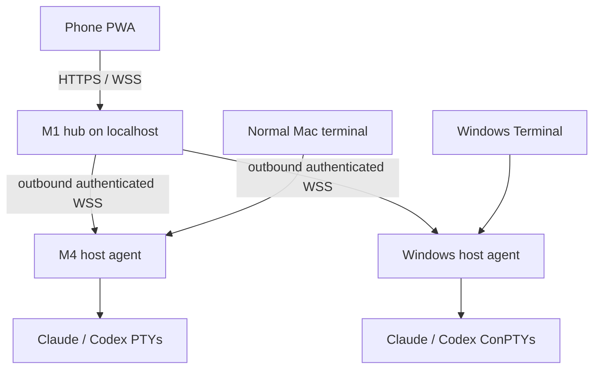

# Muxline

Muxline makes future `claude`, `claude-glm`, `codex`, and other interactive CLI launches automatically persistent and visible from a phone. Locally, the command still runs inside the terminal you opened. Closing that terminal detaches the view instead of killing the CLI.

It is not a tmux skin. A host-local broker owns a real PTY (ConPTY on Windows), a thin wrapper relays raw terminal bytes to the existing desktop terminal, and an M1-hosted hub relays the same session to a mobile xterm.js client over Tailscale.

> **Current state:** this repository contains the first end-to-end MVP: transparent command shims, host PTY ownership, exact argv/cwd/environment forwarding, local detach/reattach, a multi-host outbound hub connection, reconnectable headless terminal snapshots, one-writer control leases, and the phone web UI. The next reliability milestone is splitting each PTY into its own runner process so an agent upgrade cannot end all managed sessions.

## Why this shape



- The M4 and Windows agents own their processes. If the M1 hub is unavailable, local sessions continue.
- The M1 hub stores no terminal transcript. It holds session metadata and relays live frames in memory.
- The web backend binds only to loopback. Tailscale Serve provides tailnet-only HTTPS and identity headers.
- The phone opens in read-only mode. One explicit controller owns both input and PTY resizing.
- Desktop grid dimensions are preserved on the phone by default, avoiding constant TUI reflow.

## Hard limits

Muxline cannot retroactively attach to a Claude/Codex process that was launched in an ordinary terminal before the shim was installed. The original terminal owns that PTY master. Install once and future invocations are automatic.

A host going to sleep freezes its processes. A host reboot ends them. Claude/Codex's own `--resume` still works and remains separate from Muxline's live terminal session ID.

Terminal byte fidelity is high, but “pixel-identical to every terminal emulator” is not a physically meaningful guarantee. The desktop uses the original emulator; the phone uses xterm.js. Proprietary image protocols, terminal-specific keyboard extensions, and font metrics can differ.

## Prerequisites

- Node.js 22.12 or newer.
- macOS on the Macs and a current Windows 11 build on the PC.
- Tailscale on the M1, phone, and host computers.
- Xcode Command Line Tools only if the packaged macOS `node-pty` prebuild is unavailable. Current macOS arm64 and Windows x64 packages include prebuilt PTY binaries.

## Build

```bash
npm install
npm run typecheck
npm test
npm run build
npm link
```

## Run the M1 hub

Create one random agent token and keep it identical on the hub and both host agents.

```bash
export MUXLINE_AUTH_MODE=tailscale
export MUXLINE_HUB_AGENT_TOKEN="$(openssl rand -hex 32)"
export MUXLINE_ALLOWED_TAILSCALE_USERS="your-tailnet-login@example.com"
npm run dev:hub
```

From another M1 terminal, publish only the loopback hub to the tailnet:

```bash
tailscale serve --bg 7338
tailscale serve status
```

Do not use Tailscale Funnel. Funnel is public and does not supply the identity headers used here.

## Connect a host

On the M4 and Windows computer, save the M1's Tailscale Serve URL and the same agent token once:

```bash
muxline configure-hub "https://your-m1.your-tailnet.ts.net" "the-same-random-agent-token"
muxline agent
```

The first run creates `~/.muxline/agent.json` with a stable host ID, local authentication secret, and the saved hub settings; on macOS it is created mode `0600`.

On Windows PowerShell:

```powershell
muxline configure-hub "https://your-m1.your-tailnet.ts.net" "the-same-random-agent-token"
muxline agent
```

After confirming `muxline doctor` works, install the per-user agent at login:

```bash
./scripts/install-agent-macos.sh
```

```powershell
.\scripts\install-agent-windows.ps1
```

The macOS installer creates a LaunchAgent. The Windows installer creates a limited, interactive-user Scheduled Task—not a privileged Session 0 service, because ConPTY and your Claude/Codex credentials belong to your normal login session.

## Make the commands automatic

Run this once on each host:

```bash
muxline shim claude claude-glm codex
```

Add the printed `~/.muxline/bin` directory before the rest of `PATH`, then open a fresh terminal. From then on these remain normal:

```bash
claude --dangerously-skip-permissions --resume
claude-glm --resume
codex --yolo
```

Muxline parses none of those harness flags. It forwards the already shell-tokenized argv array. Non-interactive or piped invocations bypass the broker so automation keeps normal stdin/stdout and exit-code behavior.

`claude-glm` must resolve to an executable script/file. A shell-only alias or function cannot be executed by a background daemon; convert it to a small executable adapter first. `muxline shim` detects this instead of silently launching a different login-shell environment.

## Useful commands

```bash
muxline list
muxline attach <session-id>
muxline doctor
muxline agent
```

There is no detach prefix to remember. Closing the terminal window detaches it. Exiting Claude/Codex ends the managed PTY normally.

## Phone behavior

- Open the M1 Tailscale Serve URL in Safari and optionally add it to the Home Screen.
- Sessions are grouped by host, with live/offline, cwd, dimensions, and controller status.
- Opening a session is read-only.
- **Take control** is an explicit takeover; the desktop becomes an observer.
- **Fit phone** changes PTY geometry only while the phone owns control.
- The key strip provides Escape, Tab, arrows, Ctrl-C, Ctrl-D, Enter, paste confirmation, and keyboard focus.

## Fastest no-code reference implementation

Zellij 0.44 now has native Windows support, authenticated web clients, persistent sessions, read-only tokens, and improved mobile handling. It is an excellent immediate proof of the idea and a future optional Muxline backend. It is not the foundation here because its full-fidelity web protocol is not a stable public API, its UI would remain per-host, and running locally inside it reintroduces a nested terminal/multiplexer layer.

See [architecture](docs/architecture.md), [security model](SECURITY.md), and the [delivery plan](docs/roadmap.md).
