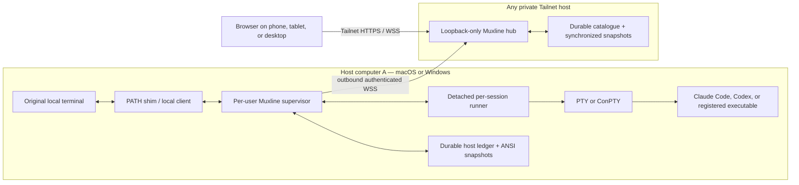
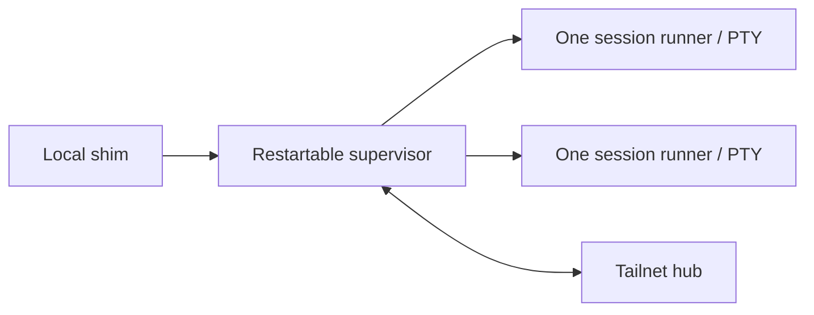

# Architecture

Muxline is a cross-host **terminal-session registry and live bridge**. It does not replace Claude Code's or Codex's own conversation store, and it does not treat a surviving ANSI screen as a model session. Its job is to make the lifecycle of registered interactive launches observable and usable from any device on a private tailnet.

The architecture is intentionally generic: any supported macOS or Windows computer can be a host, and any private tailnet node can be the hub. Hardware names are deployment examples, not part of the model.

## Roles and trust boundaries



### Host supervisor and session runners

The per-user host agent is a restartable supervisor. Each managed runtime has a detached local runner that owns its PTY/ConPTY, headless mirror, control lease, and final screen. The supervisor is responsible for:

- receiving interactive launch requests from local shims;
- writing a private launch envelope and starting one runner per interactive runtime;
- reconnecting to a runner after its own restart through a random-token loopback endpoint;
- relaying raw terminal bytes between local/remote viewers and the runner;
- keeping a host-local durable ledger of logical session records and last-known ANSI screens;
- resolving launch profiles, workspace identity, and best-effort native Claude/Codex references; and
- making a single outbound authenticated hub connection when configured.

The local API binds to loopback and is authenticated with a per-agent secret. A host agent is deliberately run as the signed-in desktop user—not root, Administrator, or a Session 0 service—because it needs that user's PTYs, credential stores, and harness configuration.

### Hub

The hub is a relay and durable catalogue, not a remote shell daemon. It binds to loopback, is expected to sit behind Tailscale Serve, and accepts authenticated outbound agent WebSockets. It:

- tracks whether a host connection is currently online;
- retains host/session metadata and synchronized ANSI screen snapshots across restarts;
- exposes the web UI and browser attachment endpoint;
- relays live terminal frames between one host agent and authorized browsers; and
- issues short-lived, single-use attachment grants before browser terminal WebSockets are accepted.

The hub never receives the agent's launch argv or environment. It does receive durable metadata such as workspace paths, profile labels, native source-path/resume hints when available, and saved terminal snapshots. Those are sensitive data and are deliberately documented in [the security model](../SECURITY.md).

### Web UI

The browser is a client of the hub only; it never opens a direct connection to a host agent. It presents the durable hierarchy:

```text
Host → Workspace → Harness / profile → Logical session
```

For a live session, it renders an xterm.js terminal and begins read-only. Input and PTY resize require the explicit, renewable control lease. For every other state, it renders a read-only record inspector and, when available, the last-known screen.

## Core identities

Muxline uses several IDs because “the session” is not one thing:

| Identity | Owner | Lifetime | Why it exists |
| --- | --- | --- | --- |
| Host ID | Muxline agent | Persistent per host installation | Distinguishes the computer that owns paths and PTYs. |
| Workspace ID | Muxline | Stable per host + canonical directory | Groups launches without pretending local paths are portable. |
| Profile ID | Muxline | Configuration/command-name stable | Labels the invocation (`claude-glm`, `codex-claude`) separately from the harness. |
| Logical session ID | Muxline | Durable | The record shown in the UI across a live runtime, normal exit, interruption, and same-host rebind. |
| Runtime ID | Muxline | One live PTY binding | Changes whenever a new broker-owned PTY is launched. |
| Native session ID | Claude Code or Codex | Harness-owned | Opaque pointer to the harness's own saved context. Muxline never invents it. |

The complete model is specified in [session-model.md](session-model.md).

## Launch path

1. A command-specific PATH shim (for example `claude`, `codex`, or an executable `claude-glm` proxy) invokes `muxline run` with a profile name, absolute target, and untouched user argv.
2. If stdin and stdout are interactive TTYs, the local client sends a launch envelope to its loopback agent. Piped/non-interactive use bypasses Muxline and runs normally.
3. The agent canonicalizes the cwd, describes the local Git workspace if available, resolves the profile's harness/provider label, and creates or rebinds a logical record.
4. The agent starts a detached runner; that runner starts the target in a PTY/ConPTY. The local client enters raw mode and relays bytes without parsing harness flags or terminal escape sequences.
5. The runner owns the headless mirror, forwards terminal bytes through the supervisor, and writes a final screen/descriptor. The supervisor journals records and publishes updates/snapshots to the hub when connected.
6. Closing the local terminal only disconnects that local viewer. A supervisor restart can rediscover a healthy runner; the runner remains the PTY owner until the harness exits, the runner fails, or the host goes away.

The transparent path adds only Muxline's private environment variables and, for Claude Code, a per-launch plugin directory used for native lifecycle correlation. It does not edit the user's project, global Claude settings, or harness binary.

## Profiles are not harnesses

The invocation name that a person types is a Muxline **profile**. The process semantics that own native context are a **harness**.

```text
claude-glm       ─┐
claude-anthropic ─┼─> harness: Claude Code
claude           ─┘

codex            ─┐
codex-claude     ─┼─> harness: Codex
codex-local      ─┘
```

The profile carries its own ID, label, invocation, and optional provider/mode label. `muxline profile set` can correct any inference. This lets the web UI represent a proxy accurately without telling it to use the wrong native resume adapter.

Shell aliases and functions do not have an executable pathname that a background daemon can safely invoke. The shim installer therefore wraps executable commands only; an alias needs a real executable adapter first.

## Durable records and snapshots

### Host ledger

The agent stores one JSON record per logical session and a separate ANSI snapshot file in its Muxline data directory. File-per-session storage keeps a bad record from invalidating every other session. Writes are atomic and size-limited; an oversized snapshot is refused rather than blocking terminal output.

The durable record includes lifecycle timestamps, exit/interruption information, dimensions, workspace/profile metadata, native-session confidence, and snapshot metadata. It does not include the original argv or environment. The snapshot is a serialized terminal state, not an authoritative full transcript or a re-created Claude/Codex conversation.

### Hub catalogue

When a host is connected, it sends the hub an additive session list, upserts, and saved snapshots. The hub stores the catalogue and snapshot so a device can inspect a record even while the source computer is offline. A newer session revision wins; reconnecting hosts do not erase previously stored saved records merely because their current live list is shorter.

There is no automatic retention expiry yet. Deleting ledger/catalogue data is an administrative action, and copies/backups must be treated as terminal-sensitive data.

### Correct snapshot attachment

Replaying an arbitrary suffix of terminal bytes can break escape sequences, alternate-screen state, cursor position, colors, and modes. Muxline uses a serialized headless xterm snapshot plus monotonically sequenced output:

1. An attaching viewer notes output sequence `N`.
2. Snapshot serialization is ordered after every prior headless write through `N`.
3. Output produced while the snapshot is being generated is buffered only for that viewer.
4. The viewer receives `SNAPSHOT(N)`, then `OUTPUT(N+1...)`.

A slow viewer is detached when its WebSocket buffer crosses the configured cap; it can reconnect and obtain a fresh snapshot without slowing PTY draining.

## Lifecycle, reachability, and rebind

The logical-record state is deliberately different from the process state.

| Condition | Durable record | Web presentation |
| --- | --- | --- |
| Agent owns a running PTY and is hub-connected | `live` with a runtime ID | `live`; viewer may take control. |
| Same live agent temporarily loses hub connectivity | Still `live` locally | `unreachable`; no remote attach until reconnect. |
| Managed harness exits | `saved`, with exit information and final snapshot when available | Saved inspector; no input. |
| Supervisor restarts while its runner remains healthy | Still `live` | Agent re-authenticates to the runner and republishes it. |
| Runner cannot be reached after recovery | `interrupted` | Interrupted inspector; no input. |
| A known native session is launched through the same host agent | Existing record gets a new runtime ID and a `reboundAt` event | `live` again if the host is connected. |

`unreachable` is derived from hub reachability and is not written as a fake closed state. `rebound` is an event rather than a separate state: it says a new broker PTY is now associated with a prior logical record.

On a hub reconnect, the agent sends its durable list and retained snapshots again. On a supervisor restart, it scans private runner descriptors, authenticates to healthy loopback runners, and restores their live bindings before declaring unclaimed records interrupted.

## Native Claude Code and Codex correlation

Muxline only records a native reference when it has evidence:

- An explicit native resume argument is an **exact** link.
- Claude Code's per-launch SessionStart/SessionEnd hook can report the harness-generated session ID, also an **exact** link.
- Time-bounded local session-file discovery can produce an **observed** link only when unambiguous.
- Otherwise the native reference stays **unresolved**. Muxline does not guess from prompt text or simply choose the newest file when several candidates exist.

An exact native ID may allow a same-host rebind: launching `claude --resume <id>` or `codex resume <id>` through Muxline creates a new PTY runtime but reuses the earlier Muxline logical record for the same host/harness. It is not cross-device execution and does not imply that Muxline restored context itself; the harness must successfully perform its own resume.

## Control and geometry

A PTY has one canonical `(columns, rows)` size. Two clients cannot independently resize it without visibly reflowing the application for one another.

- Any number of local or remote viewers can observe a live session.
- Exactly one renewable control lease can send input or resize.
- The local terminal requests a normal lease when it starts; a remote **Take control** intentionally transfers it.
- Read-only remote views preserve the host grid and scale text rather than silently changing PTY dimensions.
- **Fit phone** is available only to the current controller.

This also avoids two terminal frontends emitting duplicate terminal-query responses into the same process.

## Platform launch handling

On POSIX platforms, a resolved executable is launched with an argv array. On Windows, `.cmd`, `.bat`, and `.ps1` targets need a script host. Muxline uses a fixed PowerShell adapter and passes JSON argv through an encoded environment value instead of constructing an untrusted shell command string. This preserves spaces, quotes, Unicode, metacharacters, `--flag=value`, and `--` correctly.

## Process boundary

Muxline uses one detached runner per managed PTY. The runner transport is authenticated loopback TCP/WebSocket for macOS/Windows portability; it is deliberately not exposed to the tailnet:



The supervisor can update/restart without intentionally closing a healthy runner. This preserves a live terminal process on the same host; it is not a claim that an upstream Claude/Codex context can be migrated between computers.

## Failure behavior

| Failure | What continues | What the user sees |
| --- | --- | --- |
| Browser suspended or disconnected | Host PTY and record | Reconnect for a fresh live snapshot, if still live. |
| Hub unavailable | Local PTY and local attach | The host becomes `unreachable` remotely; agent retries outbound connection. |
| Host sleeps | OS pauses the PTY | Last known state until the host wakes/reconnects. |
| Host reboots | No broker PTY survives | Saved/interrupted record remains; native re-entry hint may be available. |
| Supervisor exits/restarts | Detached runner and PTY continue if the OS keeps them alive | Recovered as `live` after local descriptor authentication. |
| Runner crashes | Its PTY cannot be trusted to survive | Record becomes `interrupted`. |
| Native session storage changes upstream | Muxline record and screen survive | Native reference may be unresolved/observed; Muxline never fabricates a resume. |

Security controls and storage implications are documented in [SECURITY.md](../SECURITY.md).
