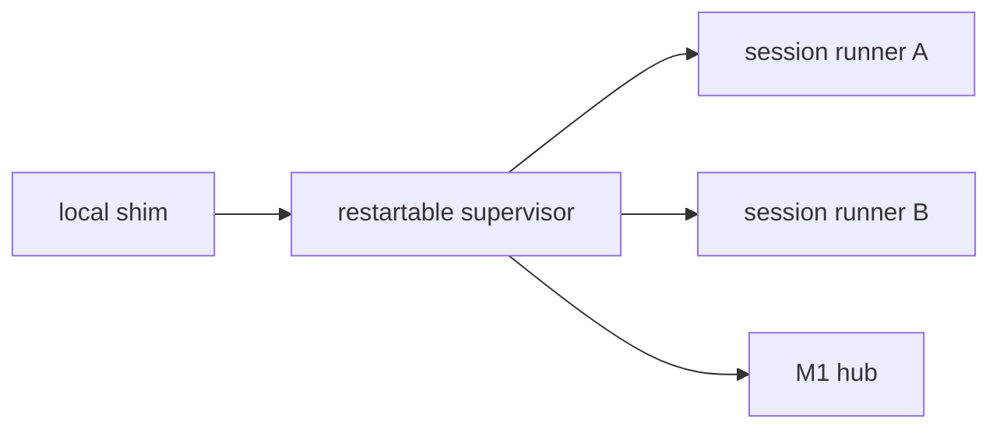

# Architecture

## Launch path

1. A PATH shim named `claude`, `claude-glm`, or `codex` invokes `muxline run` with the recorded absolute target and the untouched user arguments.
2. The local client sends a launch envelope to the loopback-only agent: profile, argv array, cwd, environment, `TERM`, rows, and columns.
3. The agent launches the target with `node-pty`. macOS uses a Unix PTY; Windows uses ConPTY.
4. The local client enters raw mode and relays bytes without interpreting Claude/Codex flags or terminal escape sequences.
5. Closing the desktop terminal ends only the local WebSocket/client. The agent continues draining and owning the PTY.
6. An outbound authenticated WebSocket registers the host and sessions with the M1 hub.
7. A browser attachment receives an atomic serialized xterm snapshot followed by sequence-numbered live output.

The existing harness remains the owner of conversation persistence. Claude's and Codex's `--resume` formats are not inspected or coupled.

## Reconnect correctness

Replaying an arbitrary suffix of raw terminal bytes is incorrect: the suffix may begin inside an escape sequence and lacks alternate-screen, cursor, color, and mode state. Each managed session therefore maintains an `@xterm/headless` mirror and `@xterm/addon-serialize` snapshot.

Snapshot creation and headless writes share one serialized async queue:

- Attach records output sequence `N`.
- Snapshot serialization is queued after every write through `N`.
- New output is buffered for that attaching viewer.
- The viewer receives `SNAPSHOT(N)`, then buffered `OUTPUT(N+1...)`.

A slow viewer never blocks PTY draining. WebSocket buffered-byte caps close that viewer, which can reconnect with a new snapshot.

## Control and geometry

A PTY has one canonical `(columns, rows)` pair. Two frontends cannot independently resize it without visibly reflowing the application for one another.

- Unlimited viewers may observe.
- Exactly one renewable control lease may send input or resize.
- The desktop requests the initial lease without forcibly stealing an existing controller.
- The phone is read-only until **Take control**, which is an explicit forced transfer.
- Read-only phone rendering preserves the desktop grid and scales the font.
- **Fit phone** is available only to the current controller.

This also prevents multiple xterm frontends from sending duplicate terminal query responses into one PTY.

## Process boundaries

The MVP uses one host agent process for all PTYs. The target production boundary is:

Each runner will own exactly one PTY, headless mirror, bounded delta ring, and local IPC socket. A supervisor upgrade then rediscoveries runners instead of closing their PTY handles. This separation also respects node-pty's documented non-thread-safe boundary.

## Windows launch adapters

Native `.exe` targets launch directly with an argv array. `.cmd`, `.bat`, and `.ps1` targets require a script host. Muxline does not concatenate untrusted arguments into a shell string. It places JSON argv in a base64 environment value and invokes a fixed, encoded PowerShell adapter that decodes the array and calls the absolute target with array splatting.

Fixtures cover spaces, quotes, Unicode, metacharacters, `%PATH%`, `--flag=value`, and `--`. The original shim itself is a `.cmd` file because that is how npm-installed Windows CLIs are conventionally exposed.

## Hub failure behavior

- Hub unavailable: local sessions and local attach continue; the agent reconnects with backoff.
- Phone suspended: its WebSocket may die; the session continues and resnapshots later.
- Host asleep: session freezes and is shown offline.
- Agent exits in the current MVP: its PTYs end. Per-session runners remove this coupling in the next milestone.
- Host reboot: in-memory processes end. A later recovery action can invoke the harness's own resume feature; that is recovery, not live-process persistence.
