# Session model

Muxline has to model three different things without conflating them:

1. a **live PTY** that is currently owned by one host agent;
2. a **native harness session** that Claude Code or Codex owns in its own storage; and
3. a **durable Muxline logical record** that identifies the work a person sees in the web UI.

The logical record is the durable center of Muxline. A PTY can disappear and a native session can be unresolved, yet the record remains useful: it says which computer and directory the work belonged to, what was launched, what Muxline last saw, and whether a native re-entry pointer is trustworthy.

## The user-visible hierarchy

```text
Host computer
└── Workspace (canonical directory on that host)
    └── Harness / launch profile
        ├── Logical session A
        ├── Logical session B
        └── Logical session C
```

The workspace is a grouping key, not the identity of a session. Several different Claude Code or Codex conversations launched in the same directory remain separate logical sessions. A path on one computer is not treated as a portable path on another computer.

## Identity fields

| Field | Meaning | Owner |
| --- | --- | --- |
| `hostId` | Stable UUID created in the per-user Muxline agent configuration. | Muxline |
| `workspace.id` | Hash of the host ID and canonical cwd. The record also retains display path, Git root, and optional repository label. | Muxline |
| `profile.id` | Registered invocation name, usually the shimmed command such as `claude`, `claude-glm`, or `codex-claude`. | Muxline |
| `profile.harness` | `claude-code`, `codex`, or `generic`. It selects behavior such as native correlation. | Muxline configuration |
| `session.id` | Durable logical-session UUID displayed and retained by Muxline. | Muxline |
| `runtimeId` | UUID for one currently live broker-owned PTY. It is null after that runtime ends. | Muxline |
| `nativeSession.id` | Opaque session/thread identifier emitted or stored by Claude Code or Codex. It can be null. | Native harness |

`claude-glm` is therefore not a third harness. It can be a profile whose harness is `claude-code` and whose provider label is `GLM`. Similarly, a Codex command pointed at another model remains a Codex profile unless the executable is actually a different harness.

## A logical record

Conceptually, Muxline stores the following shape for each logical session:

```text
logical session
  id, revision, display name
  host + workspace
  profile (invocation, harness, optional provider label)
  lifecycle state, timestamps, exit/interruption information
  current runtime ID only while live
  native harness reference + confidence
  terminal dimensions and output sequence
  last-known ANSI/xterm snapshot metadata
```

The record deliberately does **not** contain the original argv or environment. The live process receives those at launch, but they are not written into the Muxline ledger or hub catalogue.

## State machine

```mermaid
stateDiagram-v2
    [*] --> live: managed interactive launch
    live --> saved: managed PTY exits normally
    live --> interrupted: agent/host stops; PTY survival is not proven
    saved --> live: same host + known native resume through Muxline
    interrupted --> live: same host + known native resume through Muxline
    live --> live: hub disconnect/reconnect\n(web derives unreachable while disconnected)
```



There are only three durable record states:

| Durable state | Meaning |
| --- | --- |
| `live` | Muxline currently has a runtime ID for a broker-owned PTY. |
| `saved` | That managed PTY exited normally. The logical record, native reference, and snapshot remain. |
| `interrupted` | Muxline previously had a live record but cannot prove that its PTY remained after the agent or host disappeared. |

The UI adds one derived state:

| Derived UI state | Meaning |
| --- | --- |
| `unreachable` | A record still says `live`, but the source host has no active hub connection. This does not rewrite the record as exited. |

**Rebound** is an event recorded on an existing logical session, not a state. It means the agent created a fresh `runtimeId` and associated it with a prior logical record. The old PTY is not revived.

## What happens on a new launch

For a registered interactive command, the normal path is:

1. The shim reports the command name as a profile and preserves the user's argv/cwd/environment.
2. The host agent computes the workspace identity, writes a private launch envelope, and starts one detached runner that owns the PTY/ConPTY.
3. It creates a `live` logical record with a new Muxline session ID and runtime ID.
4. It starts saving last-known terminal state and publishes the record to the hub if connected.
5. It tries to obtain a native harness reference without guessing.

The local terminal, remote web UI, and host ledger all refer to that same logical session ID while the PTY is live.

## Native session references

Claude Code and Codex decide what a native session is and how it resumes. Muxline records a reference only as evidence permits.

| Confidence | How it is obtained | What it means |
| --- | --- | --- |
| `exact` | Explicit `--resume`/`resume <id>`, or a Claude lifecycle hook payload. | The native ID was supplied by the harness or user invocation. |
| `observed` | One unambiguous, recent candidate appears in a harness-local session location. | Plausible local correlation; not an assertion that Muxline restored it. |
| `candidate` | Reserved for an adapter that can offer a non-definitive choice. | Not currently promoted automatically. |
| `none` | No trustworthy native ID is known. | The record remains valid but native re-entry is unavailable. |

The native reference also has a status such as `linked` or `unresolved`. A linked ID can yield a short native re-entry hint (`claude --resume <id>` or `codex resume <id>`), but displaying that hint does not execute it and does not copy harness context across machines.

### Claude Code

For a managed Claude Code launch, Muxline adds a generated private plugin directory through Claude's per-invocation `--plugin-dir` option. The hook sends only lifecycle payload needed to link the harness session ID back to the local agent. It does not modify the user's global Claude settings, repository files, or binary.

### Codex

For Codex, a user-provided resume ID is exact. Without one, the adapter can observe a recent local session artifact only within a bounded time window and only links it if there is one unambiguous candidate. Upstream storage layouts can change; ambiguity is reported as unresolved instead of being guessed away.

## Same-host rebind

Same-host rebind is the bridge between a saved Muxline record and a later native harness resume.

```text
Earlier record: host H, harness Codex, native ID N, state saved/interrupted
                         │
Later launch on host H:  codex resume N (through the Muxline shim)
                         │
                         └── new PTY runtime binds to the earlier logical record
```

The conditions are intentionally narrow:

- it occurs on the same Muxline host, because that host owns the path, local harness files, and runtime;
- the harness must match;
- the native ID must be known from an exact resume argument or a prior exact link; and
- the native harness itself must successfully resume its own context.

On success, the logical session keeps its Muxline ID and history, receives a new `runtimeId`, and gets a `reboundAt` timestamp/event. It can then become live and remotely interactive again. This is not cross-device resume, background replay, or a promise that the native CLI accepted the resume command.

## Screen retention versus transcript retention

Muxline periodically serializes the headless terminal state to an ANSI/xterm snapshot. It does this so a viewer can see the last known screen even when no PTY is live. It is not equivalent to a full Claude/Codex transcript:

- it cannot reconstruct native model state;
- it cannot accept input when the record is not live;
- it can differ from the original emulator because fonts, graphics protocols, terminal features, and screen dimensions differ; and
- it may contain visible terminal text (and serialized buffer content), so it is sensitive data.

The host ledger saves the record and snapshot locally. Connected hosts synchronize them to the hub, which retains them so an offline source computer remains inspectable. There is no automatic expiry or encryption-at-rest layer in the current implementation; use full-disk encryption and protect the hub/host accounts.

## Important non-guarantees

- Muxline cannot discover or attach an arbitrary CLI PTY that was launched before its shim was installed.
- A shell alias/function is not automatically a managed profile. It must be represented by an executable wrapper.
- A healthy detached runner can be rediscovered by a restarted host supervisor through its authenticated loopback descriptor. A runner crash or host reboot still becomes `interrupted`.
- A host reboot destroys the PTY. The logical record and native re-entry hint can survive, but running process state cannot.
- Cross-device native session transfer is not implemented.
- A nearby session file, output text, workspace path, or provider label is never sufficient evidence to fabricate a native session ID.

For the component design behind this model, see [architecture.md](architecture.md). For storage and remote-control risks, see [SECURITY.md](../SECURITY.md).
